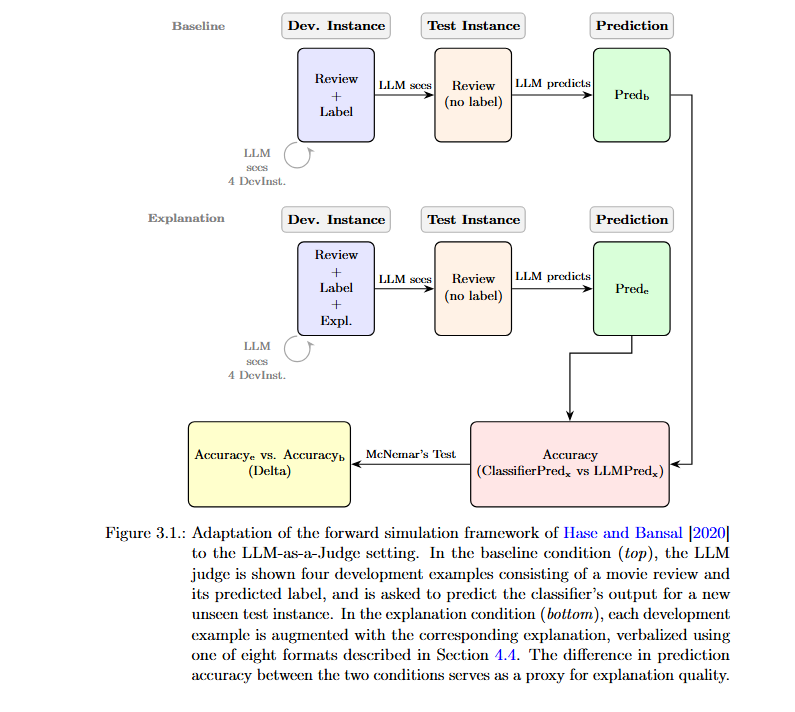
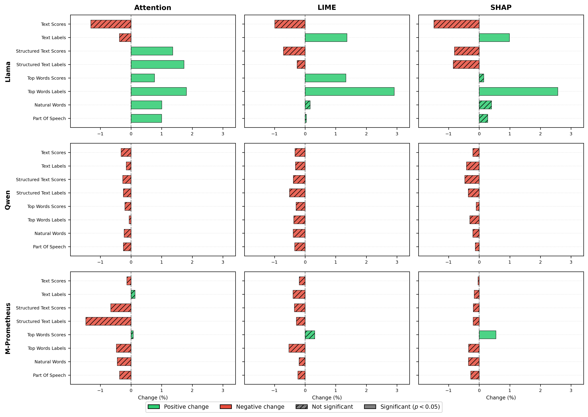
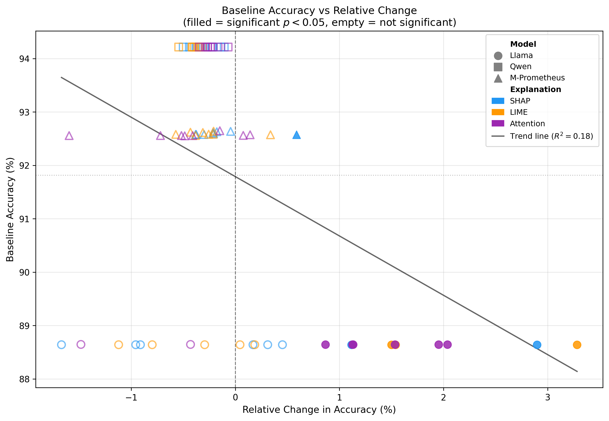

# Evaluating Explanation Quality through LLM-based Forward Simulation: A Study on Verbalization Strategies

## Introduction

This repository contains the code and data for the master's thesis 
*Evaluating Explanation Quality through LLM-based Forward Simulation: A Study on Verbalization Strategies* (University of Vienna, 2026).

The study adopts the forward simulation framework proposed by Hase and 
Bansal (2020), which tests whether explanations help a judge --- in this 
case, an LLM --- better predict the behavior of a black-box classifier.

The task is binary sentiment classification (positive/negative) on a 
custom split of the IMDB dataset (Maas et al., 2011), available at 
[antonio4210/imdb-dev-test-split](https://huggingface.co/datasets/antonio4210/imdb-dev-test-split). 
The classifier is a fine-tuned model from the Llama family 
([yash3056/Llama-3.2-1B-imdb](https://huggingface.co/yash3056/Llama-3.2-1B-imdb)). 
The original IMDB test set (25,000 instances) is subdivided into a 
development set (15,000 instances) and a test set (10,000 instances), 
with balanced label distributions.

For each test instance, the four most similar development set instances 
are retrieved (2 positive and 2 negative) based on TF-IDF cosine 
similarity, and presented to the LLM judge as few-shot examples.

The experimental setup consists of two conditions:

1. **Baseline condition**: for each test instance, the LLM observes 
the text and predicted label of the four development set instances, 
and is then asked to predict the classifier's output for the test 
instance without any explanation.

2. **Explanation condition**: the same setup, but each development 
instance is augmented with a verbalized explanation of the 
classifier's decision, in one of eight verbalization formats.

Explanation quality is measured by comparing prediction accuracy 
between the two conditions using McNemar's test. If explanations are 
genuinely helpful, the LLM judge should demonstrate improved accuracy 
when provided with explanations.

Three open-source LLM judges are evaluated:
- [meta-llama/Llama-3.2-3B-Instruct](https://huggingface.co/meta-llama/Llama-3.2-3B-Instruct)
- [Qwen/Qwen3-4B-Instruct-2507](https://huggingface.co/Qwen/Qwen3-4B-Instruct-2507)
- [Unbabel/M-Prometheus-3B](https://huggingface.co/Unbabel/M-Prometheus-3B)



---

## Requirements

Install the required dependencies with:

```bash
pip install -r requirements.txt
```

A CUDA-capable GPU is required for all inference scripts.

---

## Python Package

### Classifier Predictions

To obtain classifier predictions on the development and test sets, run:

```bash
python main_classification_model.py --split dev
python main_classification_model.py --split test
```

Predictions and ground truth labels are saved as JSON files in the 
`classification_model_predictions/` folder. These are required to 
compute LLM judge accuracy.

---

### Explanations (SHAP, LIME, Attention)

To generate raw explanations for the development set, run:

```bash
python main_explanations.py --type shap --subset_size 15000 --start 0
python main_explanations.py --type lime --subset_size 15000 --start 0
python main_explanations.py --type attention --subset_size 15000 --start 0
```

Raw explanation objects are saved as `.pkl` files in 
`explanations/pkl/`.

To convert raw explanations into the eight verbalization formats, run:

```bash
python main_explanations.py --type formatter --subset_size 7500 --start 0
python main_explanations.py --type formatter --subset_size 7500 --start 7500
```

To merge all verbalization files into a single JSON file required for 
the forward simulation experiment, run:

```bash
python main_explanations.py --type merge
```

The merged file is saved at 
`explanations/NLP_format/merged_data/merged_data.json`.

---

### Similarity Groups

To construct the four-shot development groups for each test instance 
based on TF-IDF cosine similarity, run:

```bash
python main_similarity_groups.py
```

Groups are saved at `similarity_groups/similarity_groups.json`. Each 
entry contains the test instance text, the indices of the four most 
similar development instances, and their predicted labels:

```json
{
    "0": {
        "test_instance": "review text",
        "dev_group": [12709, 342, 8599, 8613],
        "dev_predictions": [1, 0, 1, 0]
    }
}
```

---

### Forward Simulation

To run the forward simulation experiment for a single configuration:

```bash
python main_llm.py \
    --explanation_format text_scores \
    --data_size 10000 \
    --start 0 \
    --pred_order pos_neg \
    --max_new_tokens 128 \
    --prompter pairwise \
    --llm prometheus \
    --explanation shap
```

To reproduce all results, 162 configurations must be run 
(9 verbalization formats × 2 label orders × 3 judge models × 
3 explanation methods). Use the following commands to run all 
configurations automatically.

For **M-Prometheus**:

```bash
for pred_order in "pos_neg" "neg_pos"; do
  for format in "baseline" "text_scores" "text_labels" \
    "structured_text_scores" "structured_text_labels" \
    "top_words_scores" "top_words_labels" \
    "natural_words" "part_of_speech"; do
    for explanation in "shap" "lime" "attention"; do
      python main_llm.py \
        --explanation_format "$format" \
        --data_size 10000 --start 0 \
        --pred_order "$pred_order" \
        --max_new_tokens 128 \
        --prompter pairwise \
        --llm prometheus \
        --explanation "$explanation"
    done
  done
done
```

For **Llama** and **Qwen**:

```bash
for pred_order in "pos_neg" "neg_pos"; do
  for format in "baseline" "text_scores" "text_labels" \
    "structured_text_scores" "structured_text_labels" \
    "top_words_scores" "top_words_labels" \
    "natural_words" "part_of_speech"; do
    for explanation in "shap" "lime" "attention"; do
      for llm in "qwen" "llama"; do
        python main_llm.py \
          --explanation_format "$format" \
          --data_size 10000 --start 0 \
          --pred_order "$pred_order" \
          --max_new_tokens 128 \
          --prompter single \
          --llm "$llm" \
          --explanation "$explanation"
      done
    done
  done
done
```

Results are saved as JSON files at 
`test_results/{llm}/{explanation}/{prompter}/no_chain_of_thought/{pred_order}/{format}.json`.

---

### Analysis and Graphs

To run the full statistical analysis and generate all McNemar's test 
tables, run:

```bash
python main_analysis.py
```

To generate all figures used in the thesis, run:

```bash
python main_graphs.py
```

---

## Findings

The main finding of the present study is that explanations are largely 
unhelpful or inconsistent in improving the prediction accuracy of LLM 
judges. The figure below shows the absolute change in prediction 
accuracy for each verbalization format and judge model, aggregated 
across label orders and explanation methods.



Llama benefits most consistently from explanations, while Qwen and 
M-Prometheus show little or no improvement across all configurations. 
This is partly attributable to a ceiling effect: Qwen achieves a 
baseline accuracy of approximately 94%, leaving little room for 
improvement regardless of the explanation format provided.

Among the verbalization formats, label-based formats --- in which 
influential words are marked as POSITIVE or NEGATIVE rather than being 
assigned a numerical score --- consistently outperform score-based 
ones. In particular, *Top Words Labels* emerges as the most effective 
format across all three judge models and all three explanation methods, 
suggesting that concise categorical representations are more informative 
to LLM judges than verbose numerical ones.



The scatter plot above illustrates the relationship between baseline 
accuracy and absolute change in prediction accuracy across all 
configurations. Spearman's rank correlation yields ρ = −0.22 
(p = 0.064), indicating a weak negative trend in the expected 
direction --- configurations with higher baseline accuracy tend to show 
smaller or negative changes when provided with explanations --- though 
this trend does not reach statistical significance at α = 0.05 and 
should be interpreted as suggestive rather than conclusive.

---

## Citation

If you use this code or dataset in your research, please cite:

```bibtex
@mastersthesis{innocenti2026,
    author = {Innocenti, Antonio},
    title = {Evaluating Explanation Quality through LLM-based Forward Simulation: A Study on Verbalization Strategies},
    school = {University of Vienna},
    year = {2026}
}
```
